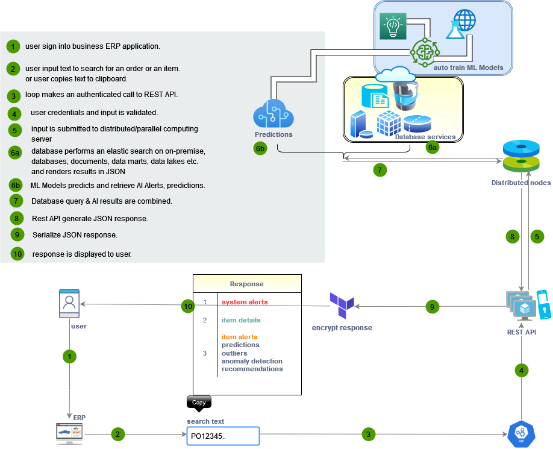

# P2P.ai

## Procure to Pay - Supply Chain Rx Inventory Graph API with Predictive Analytics
A complete data science AI framework to manage live Supply Chain Rx Inventory ERPs using Graph & Predictive Analytics.

---
#### Author: Amit Shukla
#### Contact: amit@elishconsulting.com
#### License: Creative Commons, CC0 1.0 Universal

[](https://youtube.com/AmitShukla_AI)
[](https://github.com/AmitXShukla)
[](https://medium.com/@Amit_Shukla)
[](https://twitter.com/ashuklax)

---
## TIGER GRAPH Analytics
start here:-> [https://amitxshukla.github.io/P2P.ai](https://amitxshukla.github.io/P2P.ai/)

    Complete source code/example notebooks are executed & included in documentation published under GitHub gh-pages branch.

---

## Technologies
```sbtshell
Frontend: Julia, Flutter, Olive AI
Backend: Tiger Graph DB
Rest API: Julia, TGCloud RESTAPI
AI: TigerGraph ML, Julia, Fluxml.ai, H2O.ai, Oracle AutoML
``` 

# About P2P.ai
Managing supply chain (Procure 2 Pay operations) is always a challenging tasks for any organization whether small, medium and large. And managing these operations effectively become even more critical for Healthcare providers.

Business user must have complete visibility and require operation intelligence information readily available to make quick, effective and informed decisions.

P2P.ai solves this problem. 

It acts as an AI assistant to help user make quick informed decision. As user input, search for Items, Purchase orders, DocCART or other SCM related information, Olive Loop connects to P2P.ai REST API, which render live data & predictive analytics based on pre-trained AI models, historical transactions stored in system.

# how does it work


# Application Process


# Business Process


# Physical ERD


# Dictionary
    SCM - Supply chain Management
    AUTO_REPL - Auto replenishment - automated Critical Item order when below threshold
    Rx - Pharmacy
    IN | INV - Inventory
    OLTP - Online Transaction Processing system
    ITEM - Product
    ITEM_CAT - Item Catalogue | Item Category
    UNSPSC - United Nations Standard Products and Services Code
    PO - Purchase Order
    MSR - Material Service Request | internal item transfers among Entities
    REQ - Requisition (request to create purchase order)
    RECV - Receiving
    MXP - Match Exception - Transactions which failed to match
    ON_Contract - Items which are on-contract with a given vendor
    PREF_ITEM - Items/Products identified as preferred
    Vendor - Vendor | Supplier | Manufacturer | Service Provider
    ENTITY - Operating business unit | Region | Business group
    AT_PAR - Items/Products which are critical to business operations
    DocRxCART - Items/Products which are critical to doctor's office
    CART_ITEMS - Items/Products which are critical to business operations

# License Agreement
https://raw.githubusercontent.com/AmitXShukla/P2P.ai/main/LICENSE

# Privacy Policy
https://raw.githubusercontent.com/AmitXShukla/P2P.ai/main/LICENSE
