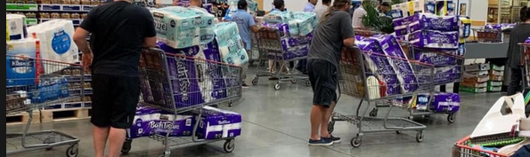
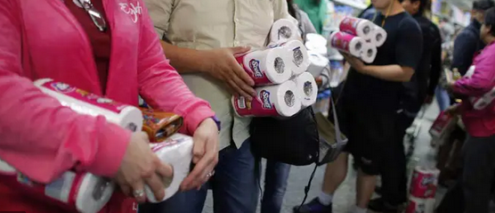
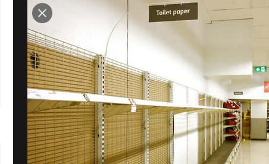
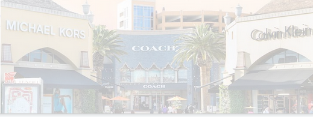
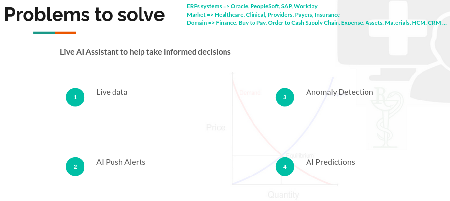

# Define Problem Statement

remember this...

---

If you are still not convinced that solving toilet paper supply chain crisis is a real problem then let me share a real story.

**January 1, 2020**

Search Engines, GPS Location and Cookies are heavenly technologies.

Jan 1, 2020 6:00am, after 200 meters of running, my new year resolution came to end with conclusion, I need a new pair of shoes.

Later, I googled it, then decided to pay a visit to outlet mall looking at latest NIKE, ADIDAS shoes.

My family took this opportunity to visit Michael Kors, Coach and Hugo Boss.
It was huge rush in mall, so I couldn’t decide on any brand.

By the time, I reached home,
Finding a pair of shoe, was declared a national emergency on my phone and heavenly technologies came to my rescue. 

All my social media accounts were flooded by MK, Coach, Nike & Adidas ads. 
And here comes New Balance, NOBULL, Salomon shoes.

I finally ordered a new pair of running shoe and a Coach purse.
All items came via express shipping in 3 days and so did **COVID…**

Jan 2020, I learned that vaccine is coming soon,
Washing hands frequently, use of Hand Sanitizers, keeping 6-ft physical distance and quarantine is only treatment available.

being a healthcare worker myself, I didn’t panic, At home, I took my research to Google again.

I searched everything about use of Azithromycin, dextrorphan, levorphanol, DXM, Ramdevpir, Hydroxychloroquine, Virus DNA, impact of virus on people with pre-diabetic, pre-existing conditions etc.

Meanwhile, Most of hospitals I serve, ran out of surgical gloves, hand sanitizers, face coverings. Cleaning supplies, Chlorine, PerOxide, Bleach disappeared from shelves and toilet paper were sold as gold. Patients visits, health checkups, operational procedures cancelled.

but, technologies on my phone figured out, I already bought shoes and purse, and now I need joggers.

Other hand, I was sitting clueless on 35TB of Rx Supply chain data for a decade, 
        
        did we not know already, cleaning supplies like toilet paper, hand sanitizers are essentials?
        why entire supply chain inventory replenishment process flow collapse?
        What a doctor will need in her DocX Cart before walking into operation room?
        Why didn’t we set up an auto-replenishment process based on prediction?
        how can one stop black marketing and overstocking, specially on life saving essentials?
        Where are my low inventory items in shipment?

I spent last few years figuring out, how to bring predictive analytics to Rx Supply Chain AND Today, 

**I am here to make this happen.**

---

