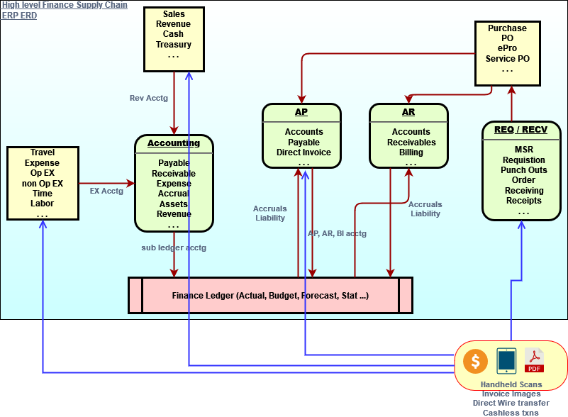
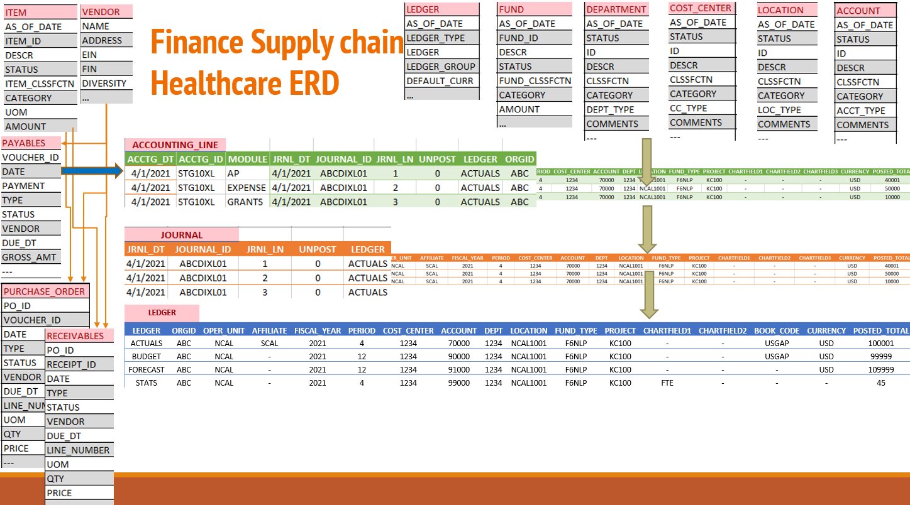

# Business process

let's us learn in detail about everything we already know.

Most of the business's procurement operations are well defined, and for organizations, who don't better need to have well defined procurement business processes defined.
A clear thoughtful defined process for manage finances and supply chain are critical not only for organizations even for individuals and families in their day to day life.

---

## operations workflow
below diagram show very high level, how most of the Procure to Pay operations are performed.

---

## Physical ERD

